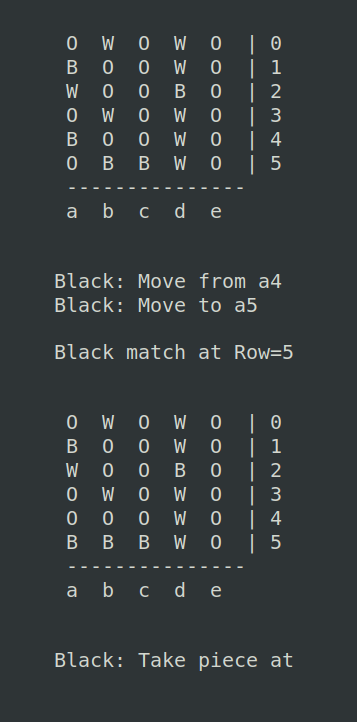

# Project

This board game was made in Prolog for a project in our PFL course.

## Group

This project was developed by:

- Marco André (up202004891)
- Ricardo Matos (up202007962)

## Instalation & Execution

This project was devloped and tested on **SICStus Prolog 4.7.1** on both Windows and Linux.
The code doesn't require any more instalation steps.

To run the project open SICStus and load the file  with `[main].`
After that, to run the game call the main function with `play.`

## Game Description

Wali board game is heavily influenced by a Nigerian game called Dara, which itself seems to be inspired in a Sudan game called Dala. As this games roots trace back to small ancient tribes, the rules are, therefore, very uncertain. Thus, the rules below defined are a combination of traits from all 3 games.

### Rules

The game is played on an empty 5x6 square board and each player has 12 colored pieces (black and white).

The game is divided into 2 phases:

- Drop phase (1st)
- Move phase (2st)

#### Drop phase

On each turn, each player drops a piece of their color onto any empty space on the board with the only restriction being no orthogonal adjacent stones of the same color (therefore no 2 stones of the same color can by placed next to eachother in a cross-like pattern but diagonal placemment is allowed).
If a player can't place any more stones he must pass. This phase continues until all stones are placed or both players can no longer place any more. The remaining stones out of the board, if appliable, are discarded.

#### Move phase

On each turn, each player moves a stone into a orthogonal adjacent cell (diagonal moves aren't allowed). If a player is able to make exactly 3 pieces align in a row or collumn (again, diagonal is forbidden), he may capture any enemy piece on the board as long as it is not part of a 3 match itself.

Restrictions to have into account:

- If more than 3 pieces are consecutively aligned, no capture takes place.
- If two 3 match are made in an L shaped pattern, only one enemy piece can be captured.
- A piece can't be moved to the position occupied in the last turn. This prevents a player from making a 3 match, undoing it, and repeating it in the next turn.

### Goal

The goal of the game is to take your oponnent pieces to the point where he has only 2 pieces left, and therefore unable to make a capture.
Another less common way to end the game is by surrounding your opponent's pieces and prevent him from making any move.

## Game Logic

TODO

### Game State Visualization

When the play/0 predicate is called, a game menu is presented where one of 4 options can be chosen:

If an option to play against a PC is picked, another menu is presented to choose the inteligence level of the AI:

To display the gameState, which consists only of the board, we  implemented the `display_game(+GameState)` predicate which essentially prints the internally represented matrix board in a human presentable format:

`W` - White occupied space
`B` - Black occupied space
`O` - Empty space

At the start of a game, the initial state is set using the `initial_state(+Size, -GameState)` predicate, where Size is a pair Col-Row. The gameState includes, apart from the empty board, the initial number of white and black pieces and who will start playing first.

The board size is predefined to be 5x6 with 12 pieces for each player however the dimensions can be easily changed in the argument 'size' of the `initial_state` predicate and the number of pieces will update accordingly.

As the game itself requires at least 3 pieces of each color to play, it isn't adviced nor pratical to have a board much smaller than 4x4.

## Set of Valid Moves

The validation and execution of a given move by the player or calculated by the AI, is assured using the predicate `move(+GameState, +Move, +Color-Phase, -NewGameState)`.
This predicate takes a gameState (a board), a move to be validated and, if correct, executes it for the Color Player given in the provided Phase, returning the new game board state.

As this game has 2 phases (drop & capture) and during the capture phase a move can be a simple move or a piece capture, this predicate quickly becomes complex. In the drop phase, we have to check if a dropping place isn't yet orthagonally adjecent to any piece of the current player (which requires a `check_cross/4` predicate). In the capture phase, a simple move only needs to check if it is made from a current player's piece position to an empty adjacent cell. Finally, to take an opposite player's piece, we only need to check if the board position contains a piece of the opponent.

If all validation succeedes for the specific move type, then the `get_piece/4` and `set_piece/5`  predicates will update the board matrix to reflect those changes.

## Computer Calculated Plays

The moves done by the computer AI are dependent on the difficulty desired, being the calculation of the best move performed by the `choose_move(+GameState, +Player-Phase, +Level, -Move)/4 ` predicate. If the AI level 1 (Random) is selected, then the behavior is not smart as only random valid moves will be preformed.

If the intelligent option is selected, then computer takes time using the previously mentioned minmax algorithm to find the move that results in the best outcome for itself and, simultaneously, the worst option for the opponent using the `get_best_play(+GameState-ObjectivePlayer, +Player-Phase, -BestPlay)/3` predicate.

In the `get_best_play/3` predicate, the computer will try to find a play using a depth search value of 3. This means it will take into account its move, the opponnents move and a second move from itself. If the result isn't satisfactory, the predicate resorts to using a depth search of 5, which predict 5 moves starting and ending with the computer playing. This calculation is used to make more intelligent plays but takes considerably more time to process.

Finally, if both minmax depth 3 and 5 fail to find a good play, then a random move will be performed.

## Conclusions

TODO

Conclusões do trabalho, incluindo limitações do trabalho desenvolvido (known issues),
assim como possíveis melhorias identificadas (roadmap) (até 250 palavras)
