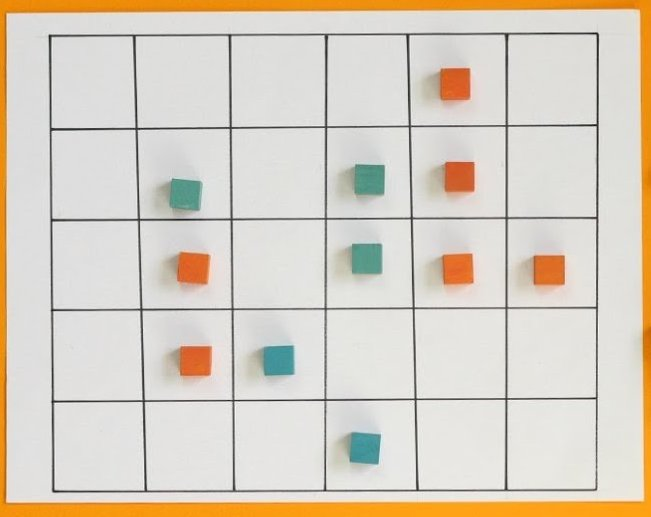
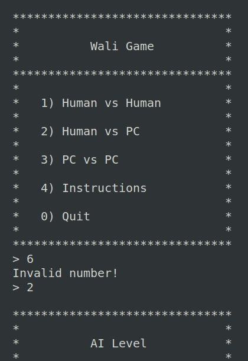
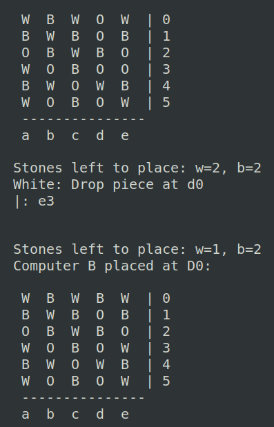

# Project - Wali_2

This board game was made in Prolog for a project in our PFL course.



## Group

This project was developed by:

- Marco André (up202004891) - 50%
- Ricardo de Matos (up202007962) - 50%

## Instalation & Execution

This project was devloped and tested on **SICStus Prolog 4.7.1** on both *Windows* and *Linux*.
The code doesn't require any code specific instalation steps.

To run the project open *SICStus* and load the file  with `[main].`
After that, to run the game, call the main predicate with `play.`

## Game Description

Wali board game is heavily influenced by a Nigerian game called Dara, which itself seems to be inspired in a Sudan game called Dala. As this games roots trace back to small ancient tribes, the rules are, therefore, very uncertain. Thus, the rules below defined are a combination of traits from all 3 games.

### Rules

The game is played on an empty 5x6 square board and each player has 12 colored pieces (black and white).

The game is divided into 2 phases:

- **Drop phase** (1st)
- **Move phase** (2st) → which in itself contains the **peek phase**

#### Drop phase

On each turn, each player drops a piece of their color onto any empty space on the board with the only restriction being no orthogonal adjacent stones of the same color (therefore no 2 stones of the same color can by placed next to eachother in a cross-like pattern but diagonal placemment is allowed).
If a player can't place any more stones he must pass his turn. This phase continues until all stones are placed or both players can no longer place any more. The remaining stones out of the board, if appliable, are discarded.

#### Move phase

On each turn, each player moves a stone into a orthogonal adjacent cell (diagonal moves aren't allowed). If a player is able to make exactly 3 pieces align in a row or column (again, diagonal is forbidden), he may capture any enemy opponent on the board and remove it from the game (peek phase).

Restrictions to have into account:

- If more than 3 pieces are consecutively aligned, no capture takes place.
- If two 3 match are made in an L shaped pattern, only one enemy piece can be captured.

### Goal

The goal of the game is to take your oponnent pieces to the point where he has only 2 pieces left, and therefore unable to make a capture.
Another less common way to end the game is by surrounding your opponent's pieces and prevent him from making any valid move.

## Game Logic

### Internal game representation

#### Board

 The game board is represented by a 2D array in which 'O' represents an empty space on the board. Using the `gen_2d_array(Row, Col, 'O', Board)/4` predicate, we are able to make our program more modular.
'B' denotes a black piece and 'W' a white piece
It is also worthy to note that the size of the board is stored dinamically in the following line:

```prolog
asserta((board_size(R, C) :- R is Row, C is Col, !)),
```

Below we present some boards examples in different game stages:

Initial state:

```prolog
Board = [['O','O','O','O','O'],
         ['O','O','O','O','O'],
         ['O','O','O','O','O'],
         ['O','O','O','O','O'],
         ['O','O','O','O','O'],
         ['O','O','O','O','O']],
```

Intermedium state with white opportunity to capture:

```prolog
Board = [['B','W','O','O','W'],
         ['O','O','O','O','O'],
         ['O','B','B','W','O'],
         ['O','O','W','W','B'],
         ['O','W','O','B','O'],
         ['W','B','O','B','O']],
```

End State:

```prolog
Board = [['O','O','O','O','O'],
         ['O','O','O','B','O'],
         ['O','W','O','B','O'],
         ['O','W','O','B','O'],
         ['O','O','O','O','O'],
         ['O','O','O','O','O']],
```

#### Current phase

The current phase represents the current phase of the game. This is a useful predicate to have as it allows the AI to know what phase it currently is in and act accordingly. The phase can be either drop, capture or peek.

```prolog
% phase(+Phase)/1
phase(drop).
phase(capture).
phase(peek).
```

#### Current player

The current player is the player in the head of the turn List. The turn list is a list of players, which is randomly generated at the start of the game. This way, we can easily change the order of the turns and make the game more dynamic. Players are represented by the atoms human and computer.

```prolog
% player(+Player)/1
player(human).
player(computer).
```

#### Move

Finally, it was also worth it to have a good representation of a move. We represented it with a pair of pairs structure: `CC-CR/NC-NR`. The first pair represents the current column and row and the second pair represents the new values for column and row.

### Game State Visualization

When the play/0 predicate is called, a game menu is presented where one of 4 options can be chosen:


If an option to play against a PC is picked, another menu is presented to choose the inteligence level of the AI:


To display the gameState, which consists only of the board, we  implemented the `display_game(+GameState)` predicate which essentially prints the internally represented matrix board in a human presentable format:


Where:

`W` - White occupied space
`B` - Black occupied space
`O` - Empty space

At the start of a game, the initial state is set using the `initial_state(+Size, -GameState)` predicate, where *Size* is a Col-Row pair. The gameState includes, apart from the empty board, the initial number of white and black pieces and who will start playing first.

The board size is predefined to be 5x6 with 12 pieces for each player however the dimensions can be easily changed in the argument 'size' of the `initial_state` predicate and the number of pieces will update accordingly.

As the game itself requires at least 3 pieces of each color to play, it isn't adviced nor pratical to have a board smaller than 4x4.

#### Input Validation

To validate user input, we have many input related predicates in the `io.pl` file.

Below there's an example of input & output related to a piece move that results in a 3 match which triggers the *peek phase* prompt.

In the menu, to ensure that the user picks a valid option, we use the `read_until_between/2` predicate which will only accept a number between the selected range.

```prolog
read_until_between(Min, Max, Ret):-
    write('> '),read_number(V),
    between(Min,Max, V) -> Ret is V;
    write('Invalid number!'),nl,
    read_until_between(Min, Max, Ret).
```



In the next image we do a wrong input on purpose to show that the game program is resilient to invalid inputs, awaiting for a valid one to be given.




The validation in input occurs in two phases. The first one is presented in the `ask_pos(Str, Color, Row-Col)` predicate present in the `io.pl` file. This predicate is responsible for asking the user for a position and validating it (seeing if position is inside the board). This predicate is independent from the game state and can be used in any context. The second phase depends on the phase of the game. The `piece_drop(Board, Color, New_Board)` only accepts positions that are valid to that phase, backtracking if the move is invalid (making another call to `ask_pos/3`). The same happens with the `capture_piece(Board, Color, New_Board)` and `piece_move(Board, Color, New_Board, NewCol-NewRow)` predicate.

### Move execution

As this game has 2 phases (drop & capture) and during the capture phase a move can be a simple move or a piece capture, this predicate quickly becomes complex. In the drop phase, we have to check if a dropping place isn't yet orthagonally adjecent to any piece of the current player (which requires a `check_cross/4` predicate). In the capture phase, a simple move only needs to check if it is made from a current player's piece position to an empty adjacent cell. Finally, to take an opposite player's piece, we only need to check if the board position contains a piece of the opponent.

If all validation succeedes for the specific move type, then the `get_piece/4` and `set_piece/5`  predicates will update the board matrix to reflect those changes.

```prolog
% move(+Board, ?Move, +Color-Phase, -New_Board)/4
move(Board, CC-CR/NC-NR, Color-Phase, NewBoard) :-
    Phase == capture ->
    get_piece(Board, CR, CC, CurPos),
    CurPos == Color,
    set_piece(Board, CR, CC, 'O', NB),
    get_piece(Board, NR, NC, NPos),
    NPos == 'O',
    set_piece(NB, NR, NC, Color, NewBoard),
    Cdiff is NC - CC, Rdiff is NR - CR,
    abs(Cdiff, Cabs), abs(Rdiff, Rabs),
    Cabs =< 1, Rabs =< 1, Cabs \= Rabs;
    check_cross(Board, NR, NC, Color),
    set_piece(Board, NR, NC, Color, NewBoard).
```

### Set of Valid Moves

The validation and execution of a given move by the player or calculated by the AI, is assured using the predicate `move(+GameState, +Move, +Color-Phase, -NewGameState)/4`.
This predicate takes a gameState (a board), a move to be validated using the previously stated rules and, if correct, executes it for the Color Player given in the provided Phase, returning the new game board state.

To get the set of all valid moves, we used the buit-in `findall` predicate in conjunction with our `move/4` predicate to get all moves that fit the necessary criteria for each phase's move type.

```prolog
% valid_moves(+GameState, +Color-Phase, -Moves)/3

% Drop Phase Valid Moves
valid_moves(GameState, Color-drop, Moves):-
findall(0-0/NC-NR, (get_piece(GameState, NR, NC, 'O'), move(GameState, 0-0/NC-NR, Color-_, _)), Moves).

% Capture Phase Valid Moves
valid_moves(GameState, Color-capture, Moves):- 
    findall(Move, move(GameState, Move, Color-capture, _), Moves).

% Peek Phase Valid Moves
valid_moves(GameState, Color-peek, Moves):-
    next_color(Color, NColor),
    findall(0-0/NC-NR, get_piece(GameState, NR, NC, NColor), Moves);
    findall(Move, move(GameState, Move, Color-_, _), Moves).
```

### Final Game State

There are 2 possible ways to end the game:

- The game can be won because the opponent has no more pieces left to win the game (two or less)
- The game can be won because the opponent has no more valid moves to make (it is stuck)

To detect the first case, we just need to count the number of pieces of each color and check if one of them is less than 3. If that is the case, the game is over and the winner is the player with more pieces.
To detect the second case, we need to check if the opponent has any valid moves to make. If he doesn't, the game is over and the winner is the player with more pieces.

```prolog
% game_over(+Board, -Winner)/2
game_over(Board, Winner):- 
    (
    flatten(Board, L),
    countElem(L,'W', Wnum),
    Wnum =< 2-> Winner = 'B'
    );
    (
    flatten(Board, L), 
    countElem(L,'B', Bnum),
    Bnum =< 2-> Winner = 'W'
    );

    ( 
    valid_moves(Board, 'W'-capture, L),
    L==[], Winner = 'B'
    );
    ( 
    valid_moves(Board, 'B'-capture, L),
    L==[], Winner = 'W'
    );

 Winner = 'O'.
```

### Computer Evaluation

To evaluate the computer moves, we used the minimax algorithm. This algorithm is a recursive algorithm that calculates the best move to be made by the computer. It does so by calculating the value of all possible moves and choosing the one with the highest value. The value of a move is calculated, not by the number of pieces on the board, but by the defice between the number of captures made by the player and the number of captures made by the opponent plus a value to avoid captures of our pc pieces. We noted that this approach makes the computer more prudent but had the setback of sometimes making them repeat moves endlessly in a PC vs PC mode since neither of them wants to make a false play.

We had the need to add some arguments to the proposed `value` predicate so we added Player-Phase and Depth, needed for our minimax algorithm implementation.

The evaluation predicate is implemented in the following predicate:

```prolog
% value(+GameState-ObjP, +Player-Phase, -BestSucc, -Value, +Depth)/5
value(Board-ObjP,Player-Phase,BestSucc,Value,Depth) :-  
    valid_moves(Board, Player-Phase, MoveList),
    executeAll(Board-ObjP,Player-Phase,MoveList,BestSucc,Value,Depth).
```

### Computer Selected Moves

The moves done by the computer AI are dependent on the difficulty desired, being the calculation of the best move performed by the `choose_move(+GameState, +Player-Phase, +Level, -Move)/4` predicate. If the AI level 1 (Random) is selected, then the behavior is not smart as only random valid moves will be performed.

If the intelligent option is selected, then computer takes time using the previously mentioned minmax algorithm to find the move that results in the best outcome for itself and, simultaneously, the worst option for the opponent using the `get_best_play(+GameState-ObjectivePlayer, +Player-Phase, -BestPlay)/3` predicate.

In the `get_best_play/3` predicate, the computer will try to find a play using a depth search value of 3. This means it will take into account its move, the opponnents move and a second move from itself. If the result isn't satisfactory, the predicate resorts to using a depth search of 5, which predict 5 moves starting and ending with the computer playing. This calculation is used to make more intelligent plays but takes considerably more time to process.

Finally, if both minmax depth 3 and 5 fail to find a good play, then a random move will be performed.

```prolog
% get_best_play(+GameState-ObjP, +Player-Phase, -BestPlay)/3
get_best_play(Board-ObjP,Player-Phase,BestPlay):-
    minmax(Board-ObjP,Player-Phase,BestPlay,3); % best play with depth 3.
    nl,nl,write('Thinking a bit more for this one'),nl,nl,
    minmax(Board-ObjP,Player-Phase,BestPlay,5); % best play with depth 5.
    nl,nl,write('Cant figure a good move out... Lets just throw a move out of the box.'),nl,nl,
    choose_move(Board, Player-Phase, 1, BestPlay). % minmax fails => random move.
```

## Conclusions

We admit that this game was a bit more complex than what we were initially expecting and we are under the impression it's probably one of the hardest among the proposed game set.

With that being said, we are happy that we managed to finish it in time, respecting all the rules proposed and making the code modular. We got some issues with some of the implemented rules. For example, It was not trivial to understand all the possible ways of transitions from the drop to the capture phase. It was also not trivial to implement a good evaluation predicate for the computer due to the many phases and different applicable rules in each of them. Despite all that, we were able to solve all the issues and implement a good and playable game.

### Roadmap

If time wasn't a constraint, our focus of improvement would be direct to the implementation of a better and more robust evaluation predicate for the computer as ours is to afraid to make mistakes and will sometimes loop endlessly when playing against another computer. It also does not understand the concept of "time", making moves in an incorrect order because it knows that the opponent has no good response.
